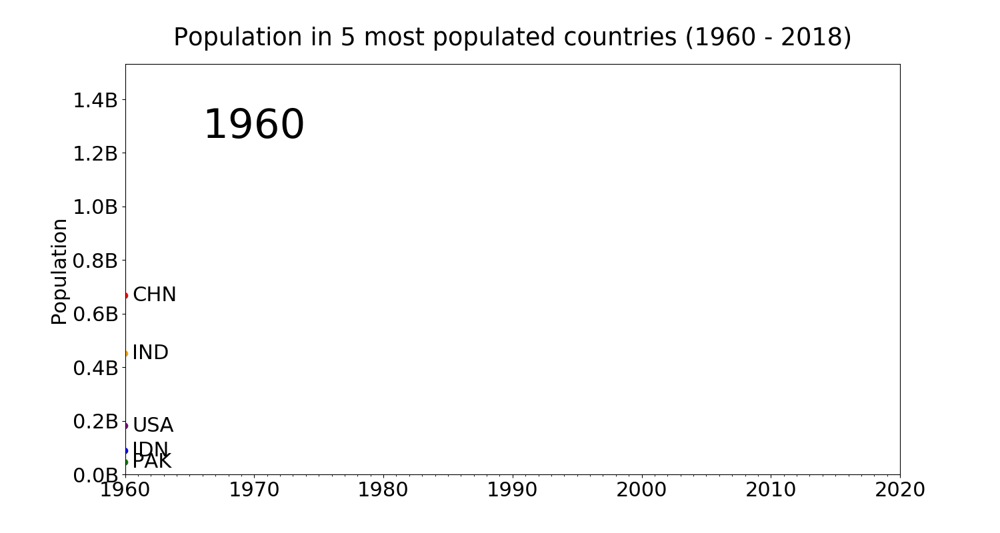
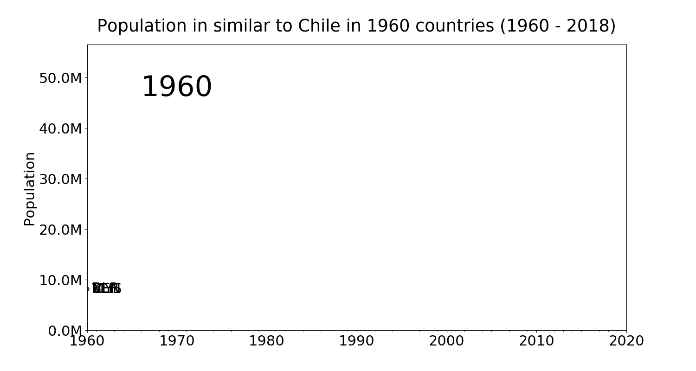

# Description
Creating animated gif charts for populations.

## Generate all examples

Every plot in proper folder is generated using commands from **cmds.sh** script.

```bash
./cmds.sh
```

## COVID-19 Spain charts

```bash
./spain_covid19.py
```

<html>
<body>
    <div style="text-align: center;">
        <p>
            
        </p>
    </div>
</body>
</html>

## Example usage

Creating population changes animated plot with Poland and 4 similar by population countries in 1960.

```bash
./anim.py population_edt.csv Poland 1960
```

# Examples

<html>
<body>
    <div style="text-align: center;">
        <p>
            
        </p>
        <p>
            
        </p>
        <p>
            
        </p>
        <p>
            
        </p>
        <p>
            
        </p>
        <p>
            
        </p>
        <p>
            
        </p>
        <p>
            
        </p>
        <p>
            
        </p>
        <p>
            
        </p>
        <p>
            
        </p>
        <p>
            
        </p>
        <p>
            
        </p>
        <p>
            
        </p>
        <p>
            
        </p>
        <p>
            
        </p>
        <h4>Gantt plot for UW calendar</h4>
        <p>
            
        </p>
        <h4>Gantt plot for UW calendar (b&w)</h4>
        <p>
            
        </p>
    </div>
</body>
</html>
